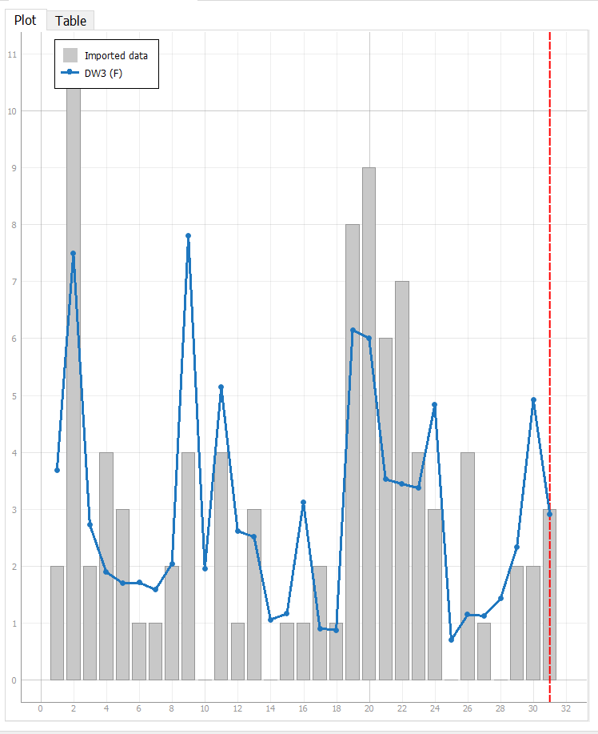

**SENG 438- Software Testing, Reliability, and Quality**

**Lab. Report \#5 – Software Reliability Assessment**

| Group 26         |          |                |
| ---------------- | -------- | -------------- |
| Liana Goodman    | 30089196 | LianaBG        |
| Amir Abdrakmanov | 30085827 | aabdrakmanov   |
| Jared Lundy      | 30086687 | jared840       |
| Jordan Lundy     | 30086686 | jordan427-prog |

**Table of Contents**
1. [Introduction](#1-introduction)
2. [Assessment Using Reliability Growth Testing](#2-assessment-using-reliability-growth-testing)
3. [Assessment Using Reliability Demonstration Chart](#3-assessment-using-reliability-demonstration-chart)
4. [Comparison of Results](#4-comparison-of-results)
5. [Discussion on Similarity and Differences of the Two Techniques](#5-discussion-on-similarity-and-differences-of-the-two-techniques)
6. [How the team work/effort was divided and managed](#6-how-the-team-workeffort-was-divided-and-managed)
7. [Difficulties encountered, challenges overcome, and lessons learned](#7-difficulties-encountered-challenges-overcome-and-lessons-learned)
8. [Comments/feedback on the lab itself](#8-commentsfeedback-on-the-lab-itself)

# 1. Introduction
This lab looks at reliability testing of a program given failure data and a multitude of testing tools. In particular, we are looking at *reliability growth testing* and *reliability assesment using reliability demonstration chart*.

This lab also provides the opportunity to compare different reliability assessments to inspect the pros and cons of each and improve future decisions on tool usage.

# 2. Assessment Using Reliability Growth Testing 

The first step taken using the Reliability Growth Testing (vis SFRAT tool) was to plot all the models on all the 
covariates to get an overall view before further analysis. The Covariates tested were: E, F, C. The models were:
  - IFR Salvia & Bollinger
  - IFR Generalized Salvia & Bollinger
  - S Distribution
  - Discrete Weibull (Order 2)
  - Discrete Weibull (Type III)
  - Geometric
  - Negative Binomial (order 2)
  - Truncated Logistic  
The overall plot is observed below:

 

The initial failure intensity was also plotted with these models as such:

The models were then compared based on their best fit using the model comaprison tool in C-SFRAT with equal metric weights (of 1.0 each) for LLF,AIC,BIC,SSE.

The picture shows the models that have a critic of 1.0 or very close to 1.0 and therefore any choice of these models is good to use for our data. Specifically, the discrete weibull type 3 on covariate F has a 1.0 critic for mean and median and therefore is the best model to use for our data based on the model comparison. All other ran models had at most 0.99 Critic and thus were not as strong models according to the comparison tool.
Therefore, the two best models to be selected are: Discrete Weibull type III (DW3 on F), with a critic of 1.0, and any of the critics of 0.99 as the other. 
  **So DW3(F) and Geometric (GM(F)) were selected as the top two models.**

The following two figures are the failures per interval graph using the best model (DW3 on F) and the failure intensity using the best model(DW3 onF)  

  The first plot plots the failure number versus the time interval. As seen in the plot, it increases until we hit the end of the testing interval. From here, it 
is difficult to comment on reliability growth since it does not appear to plateau as the interval increases.
As a result, the predictive tool of C-SFRAT was used to verify whether the failures plateaued as the time intervals increased beyond the testing interval given.
The first plot was taken for double the testing interval, ie. 33 additional intervals:

And the second plot was taken for the maximum additional interval to verify the results (99 additional intervals):

The first of these graphs show a relatively declining or plateauing curve (in terms of the line of best fit). This indicates reliability growth, since the amounts
of failures starts to happen less and less as time increases. The second graph confirms this, as it shows a much less steep curve going to 99 additional intervals. 
Therefore, the system does exhibit some reliability growth, as the failures over time intervals is predicted by C-SFRAT to be plateauing.

The second graph plots the failure intensity with the default target failure intensity of 1.0 (default to C-SFRAT tool). From this plot it appears that the failure 
intensity is quite large and does not show promise in hitting the 1.0 target. Thus, adjusting and additional testing is needed, or features must be deferred until 
later. 
Adjusting the target failure intensity to half of the default (0.5) was plotted as such:

C-SFRAT thus indicates that the software will reasonably hit the new target failure intensity rate of 0.5, using the predictive tool of C-SFRAT. Specifically, 
C-SFRAT indicates that the system will hit the target failure intensity rate at an interval of 52. Note, however, that this only occurs after the original testing
intervals is finished, but the trend appears close enough (decreasing close to the target) immediately after the 32 initial intervals. Thus, it reasonably meets
the 0.5 target.
 
Thus, based on a relatively high failure target intensity rate, the system under test does not appear to meet the threshold based on the failure intensity plot. 
However, for lower values for the target failure intensity rate, the system does appear to reasonably hit the target based on C-SFRAT's predictions. Therefore, a range
around 0.5 or lower for the target failure intensity rate is sufficient, while anything near 1.0 or above is too large.

# 3. Assessment Using Reliability Demonstration Chart
The assement done with the RDC produced varying results depending on our metrics. As shown in the 3 figures below, depending on the reliability metrics, the program may or may not be considered reliable.

*Figure 1: 2 Failures per 10,000 seconds*

For an acceptable failure rate of 2 for every 10,000 seconds, the software is clearly not reliable and should be rejected. All datapoints are firmly rooted in the *reject* zone indicating that much work still remains to be done to make the program reliable.

*Figure 2: 4 Failures per 10,000 seconds*

For an acceptable failure rate of 4 for every 10,000 seconds, the software is much more reliable and can be accepted. Though the graph varies into the *reject* zone, for the most part if has stayed in the *continue test* zone, and eventually entered the *accept* zone, indicating a positive trend. To ensure the reliability of the software, additional testing can still be done to see a more obvious trend into *accepting*. This MTTF was chosen because it is reasonable based on the data, the RDC reamins mostly in the continue testing range and the other two graphs show the affects very clearly of halfing and doubling it. 

*Figure 3: 8 Failures per 10,000 seconds*

For an acceptable failure rate of 8 for every 10,000 seconds, the software is quite clearly reliable. Though there is a brief instance of it entering the *reject* zone, it quite quickly becomes *acceptable* and stays in firmly in this zone for the rest of the data. No additional reliability data would be necessary to see that this software matches our criteria of 8/10,000.

# 4. Comparison of Results
For the RDC the software is acceptable if the failure rate is 4 per 10,000 seconds or higher. Other wise this software is unacceptable. Similarily, for reliability growth analysis, the software will be come acceptable at failure intesity of 0.5, any higher will mean that the software is unacceptable for release. Though both of these methods provide different kinds of results, we can see from both that depending on our minimal tolerance for error, the software can be accepted.

# 5. Discussion on Similarity and Differences of the Two Techniques
Both of these techniques are used to understand the reliablility of the system using failure data. Using RDC, the system can be analyzed upto the lastest failure and whether or not the system needs more testing, whereas using reliability growth analysis the trend of the system's relability can be determined and whether or not this is an acceptable goal given the failure data. 

# 6. How the team work/effort was divided and managed
Team work was divided into pairs to practice pair programming. Part 1 was given to Jared and Jordan while part 2 was given to Liana and Amir.

Each pair worked on the reliability testing before coming together to compare results. From here, the report was built together.

# 7. Difficulties encountered, challenges overcome, and lessons learned
For part 1, the actual tool softwares provided for the lab was a challenge. STRAT was not runnable for its part one functionality, and we had to resort to C-SFRAT
instead. C-SFRAT was limited, however, in its graphical displays for part one. Specifically, C-SFRAT does not support a Time-Between-Failures graph, or a reliability
plot, and thus could not be included in the report. Additionally, C-SFRAT does not provide a laplace test functionality, so this part of part one was also omitted
from our report. Since C-SFRAT was the only tool that worked for part one, we were limited to only C-SFRAT's functionalities, which resulted in us having to omit
the functionalities (Laplace Test), and graphs (Time between failures and Reliability) since C-SFRAT did not support them.

In part 2, forming the charts was a little confusing when trying to find out which cells to modify and how to modify them so that the chart would appear properly. After some trial and error, we made it work.

# 8. Comments/feedback on the lab itself
None.
